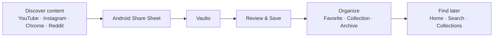
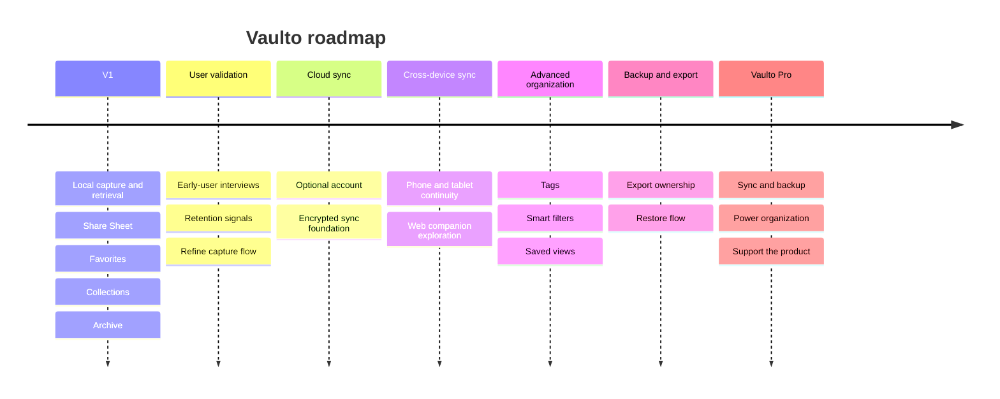

# Vaulto

## Your internet, kept in one place.

**Vaulto** is a private digital vault for the things worth returning to: a YouTube tutorial, a Reddit thread, an Instagram post, a product link, or a note you do not want to lose.

Save from Android's Share Sheet. Add context. Organize only when you need to. Find it later without scrolling through browser tabs, saved posts, or chat messages.

> **Product position:** a fast, private, offline-first place to save and retrieve useful internet content.

---

## The problem

Useful things are discovered everywhere, but saved nowhere consistently.

- Browser bookmarks become long, context-free lists.
- Social-media saves are trapped inside each app.
- Sending links to yourself in chat mixes reminders with conversations.
- Traditional bookmark managers are often too complex for a quick save.

The result is familiar: people remember *finding* something, but cannot find it again.

## The Vaulto approach

Vaulto turns an existing Android habit—**Share**—into a reliable capture flow. There is no new service to learn and no inbox to maintain.

1. Discover something useful anywhere.
2. Tap **Share**.
3. Choose **Vaulto**.
4. Confirm its title, add a note or collection if useful.
5. Retrieve it later from one calm, searchable vault.

---

## Mobile UI/UX presentation

### Visual identity

| Element | Direction |
| --- | --- |
| Theme | **Dark-first** by default; Light and System are always available in Settings. |
| Color | Deep ink/navy foundations, soft charcoal surfaces, elegant violet primary, restrained rose highlight. |
| Type | Clear Android-native sans serif; strong page titles, compact metadata, readable notes. |
| Shape | Rounded 20–24dp cards, 12–16dp controls, pill-shaped compact filters. |
| Elevation | Surface tint and subtle tonal elevation—not heavy shadows. |
| Motion | Short Android-native transitions: 150–250ms for state changes, sheets, and save confirmation. |
| Icons | Material Symbols/Material icons only, with labels for destructive or non-obvious actions. |

### 1. Home — the retrieval-first vault

**Purpose:** make recently saved content immediately useful.

- Large `Vaulto` header with a concise “your personal space” subtitle.
- Search field anchored below the header.
- Compact filter chips: **All**, **Favorites**, **Collections**, **Archived**.
- Notes appear as rounded cards: title, source/domain, optional note preview, favorite action.
- A clear primary `New note` button is always reachable.

**Empty state:** “Start building your vault” with a one-line explanation of sharing from any app.

### 2. Save Item — frictionless capture

**Purpose:** make a share feel complete in a few seconds.

- Opens directly from Android Share Sheet with the URL and detected title prefilled.
- Fetches a public page title when the sharing app only provides a link.
- Fields: **Title**, **Link**, **Collection**, **Note**.
- Collection picker supports `No collection` plus inline `New collection`.
- Primary action: `Save to Vaulto`.

**Save feedback:** short confirmation with an `Undo` affordance where possible; never leave the user wondering whether the capture worked.

### 3. Favorites — a deliberate short list

**Purpose:** preserve the handful of items a user expects to revisit.

- Header: `Favorites` and a count.
- Same card system as Home, so the list feels familiar.
- Filled heart means saved to Favorites; tapping it removes the item without extra navigation.
- Archive and Delete remain secondary actions.

### 4. Collections — lightweight organization

**Purpose:** organize only when the volume calls for it.

- `Collections` header and `New collection` action.
- Rounded rows show a folder icon, collection name, and item count.
- Examples: `Design inspiration`, `Watch later`, `Android`, `Travel`.
- A collection opens to a filtered list using the same note cards as Home.

### 5. Archive — out of sight, never lost

**Purpose:** remove clutter without forcing deletion.

- `Archived` header with back navigation.
- Familiar card list with `Restore` as the primary inline action.
- Delete is clearly separated and always confirmed.
- Empty state confirms that archived items remain private and available until deleted.

### 6. Item Details — context before action

**Purpose:** turn a saved link into a useful personal record.

- Source/domain chip, title, full note, collection, and saved date.
- Open link action uses an external-link icon and Android browser intent.
- Favorite toggle, Move to collection, Archive, and Delete are grouped in an overflow menu.
- Delete uses a destructive confirmation dialog with plain language.

### 7. Settings — ownership and clarity

**Purpose:** let people control the product without clutter.

- **Appearance:** Dark, Light, Use device settings.
- **Storage:** explains that V1 saves locally on device.
- **About:** current app version and product links.
- Future entries, when implemented: backup/export and cloud sync—not placeholders that imply unavailable functionality.

---

## Why Vaulto?

### Frictionless by design

Vaulto starts at the Android Share Sheet, exactly where saving already happens. It does not require a browser extension, special URL format, or a separate inbox.

### Organized, not over-organized

Save first. Add a short note, a favorite, or a collection only when it helps. The product stays useful for both one saved link and one thousand.

### Private and offline-first

V1 stores saved items locally on the device. Your links and notes remain available without an account or an internet connection after saving.

### Built for retrieval

Recent items, Favorites, Collections, Archive, and Search make it practical to return to useful content later.

---

## V1 feature set

- Save links with a title and optional note
- Android Share Sheet integration
- Automatic title extraction where public page metadata is available
- Favorites
- Collections
- Archive and restore
- Confirmed deletion
- Search
- Local, offline-first storage
- Android-native UI with Light, Dark, and System appearance modes

## Future: Vaulto Pro roadmap

### Pro principles

Vaulto Pro adds control and convenience, never an AI layer or a reason to complicate saving. The core capture-and-retrieve experience remains useful without a subscription.

Potential Pro capabilities:

- Encrypted cloud sync across devices
- Full backup and export
- Advanced filters, tags, and saved views
- Collection customization and richer link previews

---

## Launch-ready presentation copy

### Product Hunt / Reddit headline

**Vaulto is a private, offline-first place for the useful things you find online.**

### Short description

Stop losing great links in browser tabs, social saves, and messages to yourself. Share anything to Vaulto, add context, and find it when it matters.

### GitHub README opening

Vaulto is an Android app for saving and organizing useful links and notes from across the internet. It integrates with the Android Share Sheet, stores data locally, and keeps retrieval simple with search, collections, favorites, and archive.

---

## Validation focus

Before expanding scope, validate these product questions with early users:

1. Do people understand Vaulto immediately from the Share Sheet entry point?
2. Is the title capture accurate enough for the sources they use most?
3. Do they return to saved content within a week?
4. Which retrieval tool becomes essential first: Search, Favorites, or Collections?
5. Would they trust optional backup/sync enough to pay for it?

The success metric is not how many links are saved. It is how often someone successfully finds and uses something they saved.
